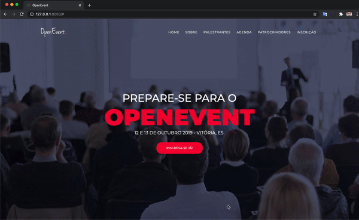

<div align="center">
  
</div>


<h3 align="center">
    OpenEvent is a simple open source system for publicizing and managing events in general and registering participants.
</h3>

<p align="center">
  

  
  
  <a href="https://github.com/kelwys/open-event/commits/master">
    
  </a>
    
   
   <a href="https://github.com/kelwys/open-event/stargazers">
    
  </a>
</p>

<p align="center">
  <a href="#about-the-project">About The Project</a> |
  <a href="#preview">Preview</a> |
  <a href="#technologies">Technologies</a> | 
  <a href="#contribution">Contribution</a> | 
  <a href="#author">Author</a> | 
  <a href="#license">License</a>
</p>

</br>


<h2 id="about-the-project" > ⏰📈 About The Project </h2>

OpenEvent is a online system for event management. Allows you to receive registrations online. Register speakers, agendas, sponsors and register in batches through csv file.


---

<h2 id="preview" >🎨  Preview </h2>



---

## 🚀 Getting Started

First, run the development server:

```bash
# Clone Repository
$ git clone https://github.com/kelwys/open-event.git

# Go to server folder
$ cd open-event

# Create a virtualenv
$ python -m venv .venv
$ source .venv/bin/activate

# Install Dependencies
$ pip instal -r requirements.txt

# Crate a super user
$ python manage.py createsuperuser

# Apply the migrations
$ python manage.py migrate

# Run Aplication
$ python manage.py runserver

# Access localhost
http://localhost:8000
http://localhost:8000/admin
```
---


<h2 id="technologies"> 🛠 Technologies </h2>

The following tools were used in the construction of the project:

- **[Python](https://www.python.org/)**
- **[Django](https://docs.djangoproject.com/en/3.2/)**
- **[HTML](https://en.wikipedia.org/wiki/HTML)**
- **[Sass](https://sass-lang.com/guide)**

---

<h2 id="contribution"> 💪 Contribution </h2>

Contributions are what make the open source community such an amazing place to be learn, inspire, and create. Any contributions you make are **greatly appreciated**.

1. Fork the Project
2. Create your Feature Branch (`git checkout -b feature/AmazingFeature`)
3. Commit your Changes (`git commit -m 'Add some AmazingFeature'`)
4. Push to the Branch (`git push origin feature/AmazingFeature`)
5. Open a Pull Request

---

<h2 id="author"> 💻 Author </h2>


 <sub><b>Kelwy Oliveira</b></sub></a> <a href="https://www.linkedin.com/in/kelwyoliveira/" title="kelwy`s linkedin">🚀</a>
 <br />

[](https://www.linkedin.com/in/kelwyoliveira/) 
[](mailto:kelwyduarte@gmail.com)

---

<h2 id="license"> 📝 License </h2>

This project is under the [MIT](./LICENSE) license.

